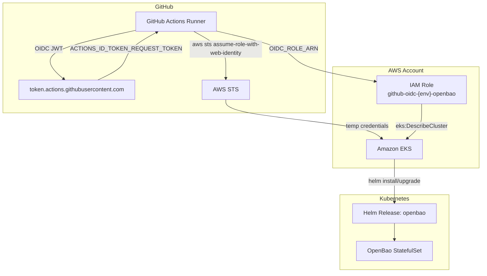
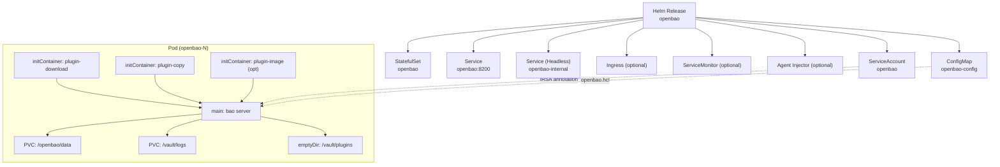
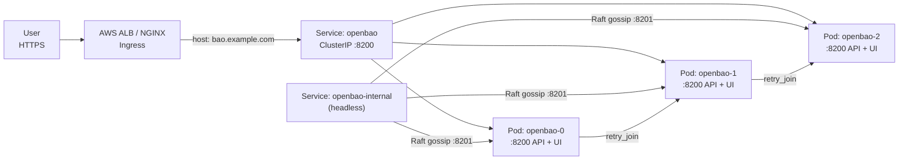
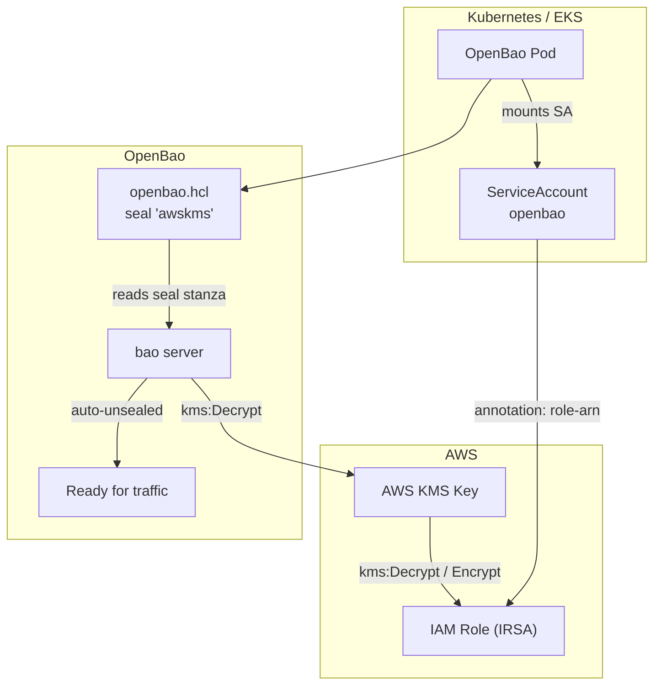
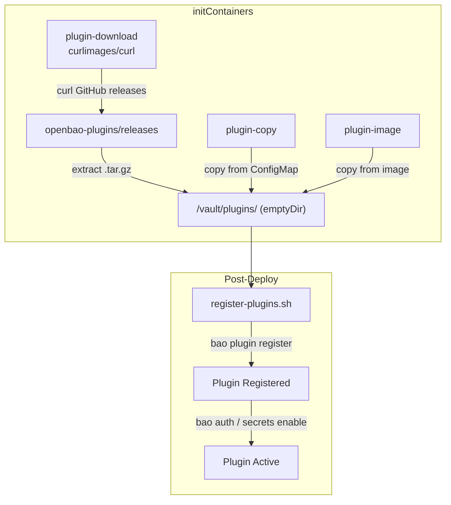
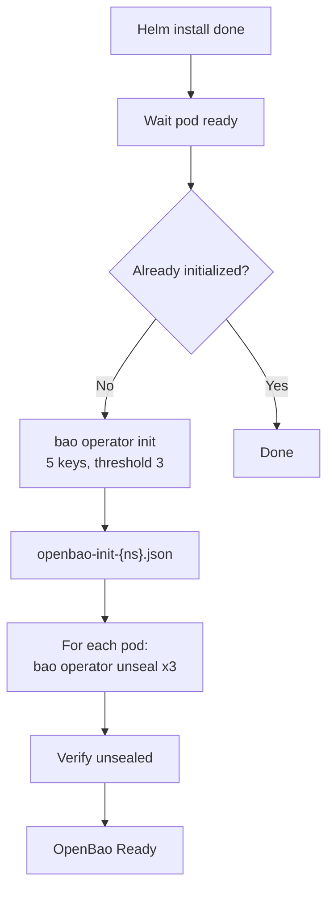

# OpenBao Kubernetes Deployment

Deploy [OpenBao](https://openbao.org) on Kubernetes with plugin support, using Helm charts, Terraform, and bash scripts.

Includes the full suite of [openbao-plugins](https://github.com/openbao/openbao-plugins) (auth: AWS, Azure, GCP, GitHub; secrets: AWS, Azure, GCP, GCPKMS, Nomad, Consul) and KMS auto-unseal.

## Project Structure

```
├── helm/openbao/              # Helm chart
│   ├── Chart.yaml
│   ├── values.yaml
│   └── templates/
│       ├── _helpers.tpl
│       ├── configmap.yaml      # HCL config with tpl rendering + dynamic retry_join
│       ├── statefulset.yaml    # StatefulSet with plugin init/download containers
│       ├── service.yaml        # Client service + headless internal service
│       ├── ingress.yaml        # ALB-compatible ingress
│       ├── injector-deployment.yaml  # Agent injector
│       ├── serviceaccount.yaml # IRSA annotation support
│       ├── ui-service.yaml
│       ├── pdb.yaml
│       └── plugin-configmap.yaml
├── terraform/                  # Terraform module
│   ├── main.tf / variables.tf / outputs.tf
│   └── examples/complete/      # Complete example with Terraform
├── scripts/
│   ├── deploy.sh               # Full deployment workflow
│   ├── init-and-unseal.sh      # Initialize & unseal cluster
│   ├── install-plugin.sh       # Runtime plugin installation
│   └── register-plugins.sh     # Register community plugins
└── README.md
```

## Architecture

### Deployment Pipeline (GitHub Actions → AWS EKS)



### Kubernetes Resources



### Network Flow



### KMS Auto-Unseal (IRSA)



### Plugin System



### Init & Unseal Flow



## Quick Start

### Prerequisites
- Kubernetes cluster (>= 1.27)
- Helm 3.6+ / kubectl
- (optional) Terraform 1.5+

### Deploy HA with all community plugins + auto-unseal

```bash
# One-command deploy with community plugins, init, unseal, and registration
./scripts/deploy.sh --mode ha --namespace openbao \
  --community-plugins \
  --init \
  --register-plugins
```

### Deploy with Helm

```bash
helm install openbao ./helm/openbao \
  --namespace openbao --create-namespace \
  --set server.ha.enabled=true \
  --set server.standalone.enabled=false \
  --set plugins.community.enabled=true \
  --set plugins.community.auth.aws.enabled=true \
  --set plugins.community.secrets.aws.enabled=true
```

## Community Plugins (openbao-plugins)

The chart can automatically download and install plugins from [openbao/openbao-plugins](https://github.com/openbao/openbao-plugins) at pod startup.

### Available Plugins

| Type    | Plugin  | Description |
|---------|---------|-------------|
| auth    | aws     | Authenticate using AWS IAM credentials |
| auth    | azure   | Authenticate using Azure credentials |
| auth    | gcp     | Authenticate using GCP credentials |
| auth    | github  | Authenticate using GitHub credentials |
| secret  | aws     | Generate AWS access credentials |
| secret  | azure   | Generate Azure service principals |
| secret  | gcp     | Generate GCP service account keys |
| secret  | gcpkms  | Encrypt data via GCP KMS |
| secret  | nomad   | Generate Nomad ACL tokens |
| secret  | consul  | Generate Consul ACL tokens |

### Enable in values.yaml

```yaml
plugins:
  community:
    enabled: true
    auth:
      aws:   { enabled: true, version: v0.1.1 }
      azure: { enabled: true, version: v0.23.0 }
      gcp:   { enabled: true, version: v0.22.0 }
      github:{ enabled: true, version: v0.0.1 }
    secrets:
      aws:   { enabled: true, version: v0.2.0 }
      azure: { enabled: true, version: v0.23.0 }
      gcp:   { enabled: true, version: v0.23.0 }
      gcpkms:{ enabled: true, version: v0.21.0 }
      nomad: { enabled: true, version: v0.1.5 }
      consul:{ enabled: true, version: v0.1.0 }
```

An init container downloads the plugin tarballs from GitHub Releases, extracts them to `/vault/plugins/`, and makes them available to OpenBao at startup.

### Register & Enable After Init

```bash
./scripts/register-plugins.sh --namespace openbao

# Selective registration
./scripts/register-plugins.sh --namespace openbao \
  --auth-plugins aws,azure \
  --secrets-plugins aws,consul
```

## Configuration: Terraform-Driven, No Hardcoded Values

The chart defaults are intentionally empty — no hardcoded regions, KMS keys, or IRSA roles.
All environment-specific values should be injected by Terraform or your config management.

### Recommended: Terraform injects KMS + IRSA

```hcl
module "openbao" {
  source = "../../terraform"

  seal = {
    type         = "awskms"
    region       = "eu-west-1"
    kms_key_id   = aws_kms_key.openbao.key_id
    irsa_role_arn = aws_iam_role.openbao_irsa.arn
  }

  values = {
    seal = {
      awskms = {
        enabled     = true
        region      = "eu-west-1"
        kms_key_id  = "alias/openbao-unseal"
        irsaRoleArn = "arn:aws:iam::123456789012:role/openbao-kms"
      }
    }
  }
}
```

### Helm only (manual)

```bash
helm install openbao ./helm/openbao \
  --set seal.awskms.enabled=true \
  --set seal.awskms.region=eu-west-1 \
  --set seal.awskms.kms_key_id=alias/openbao-unseal \
  --set seal.awskms.irsaRoleArn=arn:aws:iam::123456789012:role/openbao-kms
```

### IRSA

When `seal.awskms.irsaRoleArn` is set, the chart adds `eks.amazonaws.com/role-arn` to the ServiceAccount.

### Direct AWS Credentials (alternative to IRSA)

```yaml
seal:
  extraEnvironmentVars:
    - name: AWS_ACCESS_KEY_ID
      valueFrom:
        secretKeyRef:
          name: aws-creds
          key: access-key
    - name: AWS_SECRET_ACCESS_KEY
      valueFrom:
        secretKeyRef:
          name: aws-creds
          key: secret-key
```

## Deployment Modes

| Mode         | Replicas | Storage  | HA  | Use Case              |
|--------------|----------|----------|-----|-----------------------|
| `dev`        | 1        | in-memory| No  | Local testing         |
| `standalone` | 1        | file     | No  | Dev/small workloads   |
| `ha`         | 3        | raft     | Yes | Production            |

## HA Raft Configuration

The HA mode generates dynamic `retry_join` blocks based on `server.ha.replicas`:

```hcl
storage "raft" {
  path = "/openbao/data"
  node_id = "NODE_ID_PLACEHOLDER"  # replaced with pod name at startup
  retry_join {
    leader_api_addr = "http://openbao-0.openbao-internal:8200"
  }
  retry_join {
    leader_api_addr = "http://openbao-1.openbao-internal:8200"
  }
  retry_join {
    leader_api_addr = "http://openbao-2.openbao-internal:8200"
  }
}
```

Two services are created:
- `<name>.<ns>.svc.cluster.local:8200` — client-facing ClusterIP
- `<name>-internal` — headless service for raft cluster communication

## Plugin System (All Methods)

| # | Method | Description |
|---|--------|-------------|
| 1 | **Community plugins** | Init container downloads from openbao/openbao-plugins releases |
| 2 | **ConfigMap** | `plugins.extra` values → init container copies to `/vault/plugins/` |
| 3 | **Sidecar image** | `plugins.image` + `plugins.sidecar` for custom plugin management |
| 4 | **Script** | `install-plugin.sh` for runtime upload, register, mount |
| 5 | **Terraform** | `openbao_plugin` + `openbao_mount` resources |

## Ingress

Defaults to external (internet-facing). Change to `internal` for corporate deployments.

### External (default for this chart)

```yaml
server:
  ingress:
    enabled: true
    ingressClassName: alb
    annotations:
      alb.ingress.kubernetes.io/scheme: internet-facing
      alb.ingress.kubernetes.io/target-type: ip
      alb.ingress.kubernetes.io/certificate-arn: "arn:aws:acm:...:certificate/..."
```

### Internal (corporate)

```yaml
server:
  ingress:
    enabled: true
    ingressClassName: alb          # or nginx
    annotations:
      alb.ingress.kubernetes.io/scheme: internal
      alb.ingress.kubernetes.io/target-type: ip
      alb.ingress.kubernetes.io/certificate-arn: "arn:aws:acm:...:certificate/..."
```

## Full Configuration Example

Values are injected from Terraform or your config — nothing is hardcoded.

```yaml
server:
  ha:
    enabled: true
    replicas: 3
    raft:
      enabled: true
      setNodeId: true
  dataStorage:
    size: 10Gi
    storageClass: gp3              # set by Terraform (aws_ebs_volume)
  auditStorage:
    size: 10Gi
    storageClass: gp3
  ingress:
    enabled: true
    ingressClassName: alb          # external by default; change to internal for corporate

plugins:
  community:
    enabled: true
    auth:
      aws:   { enabled: true }
      azure: { enabled: true }
      gcp:   { enabled: true }
    secrets:
      aws:   { enabled: true }
      azure: { enabled: true }
      gcp:   { enabled: true }
      nomad: { enabled: true }

seal:
  awskms:
    enabled: true                  # set to true only when region + kms_key_id are provided
    region: ""                     # injected from Terraform (var.seal.region)
    kms_key_id: ""                 # injected from Terraform (aws_kms_key.openbao.key_id)
    irsaRoleArn: ""                # injected from Terraform (aws_iam_role.openbao_irsa.arn)

ui:
  enabled: true

injector:
  enabled: true
```

## License

MIT
