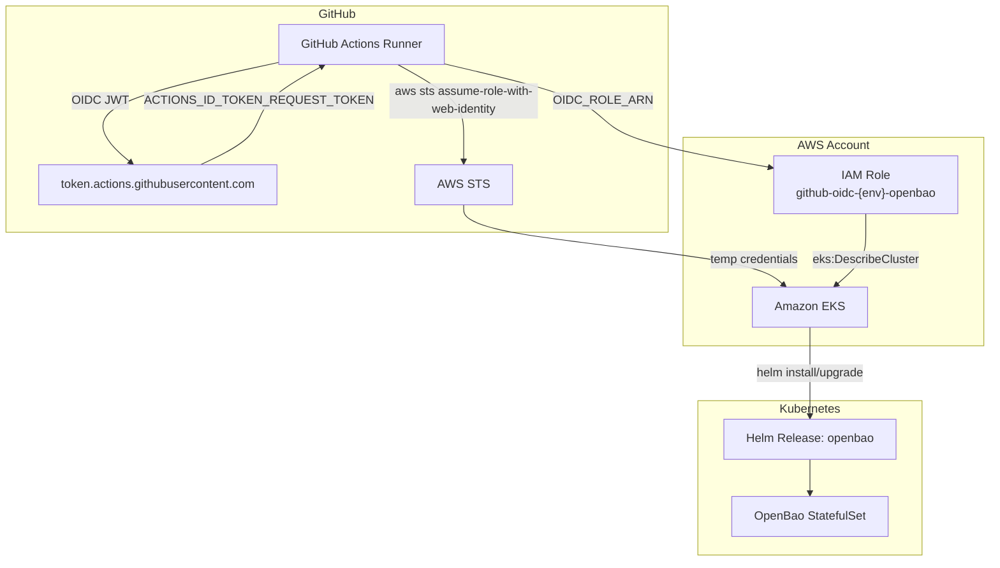
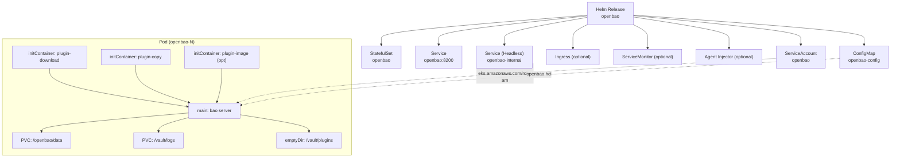
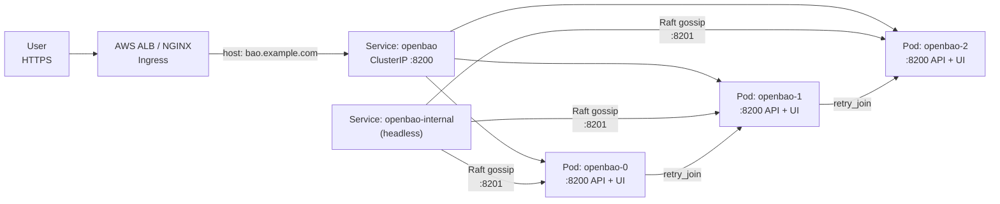
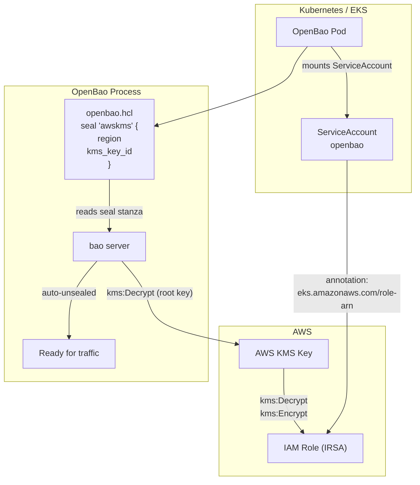
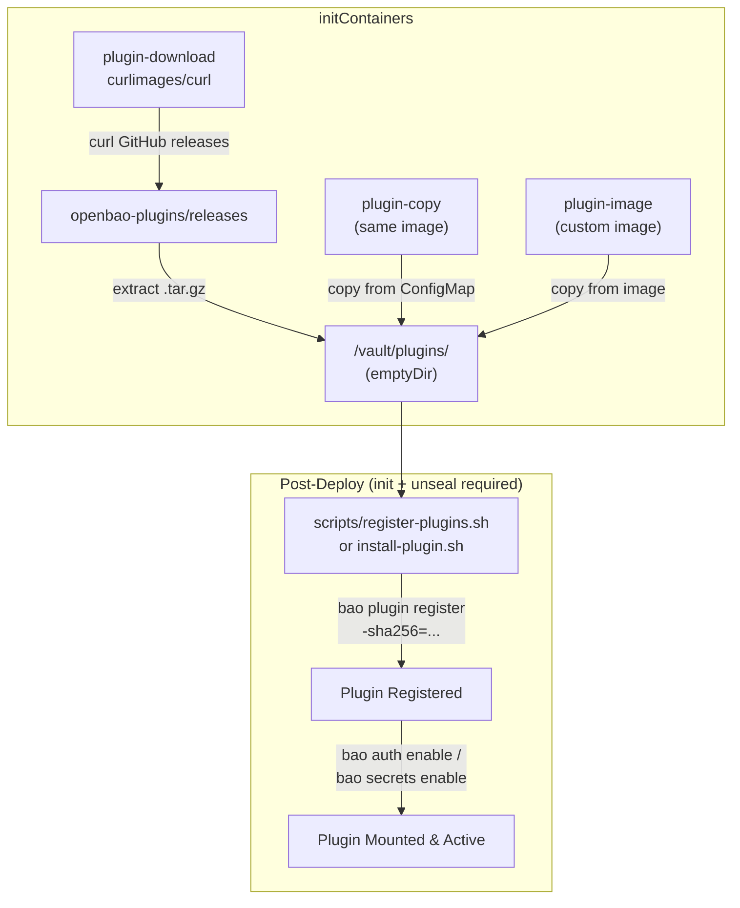
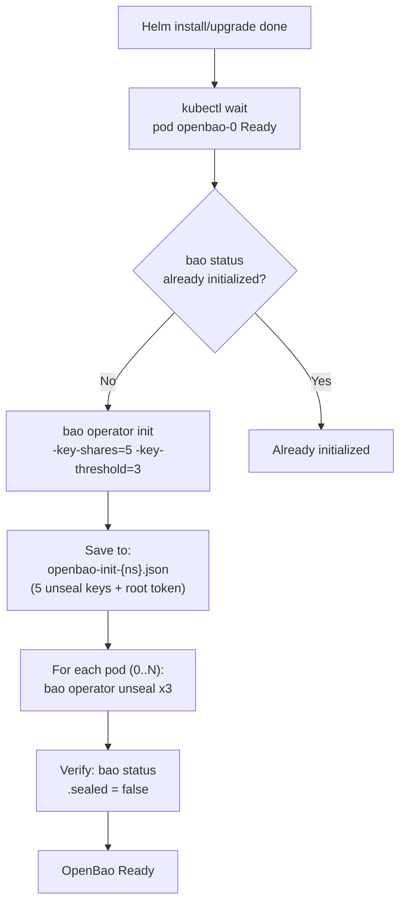
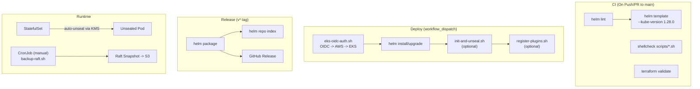

# OpenBao Deployment Architecture

## 1. Deployment Pipeline (GitHub Actions → AWS EKS)

## 2. Kubernetes Resource Architecture

## 3. Network Flow

## 4. KMS Auto-Unseal (IRSA)

## 5. Plugin System

## 6. Init & Unseal Flow

## 7. CI / Deploy / Release Trigger Map

